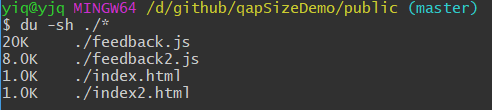

# qap实践系列

1. [qap-包大小优化](http://xiaoqiang730730.github.io/2018/03/10/qap-%E5%8C%85%E5%A4%A7%E5%B0%8F%E4%BC%98%E5%8C%96/)
2. [qap-统一入口](http://xiaoqiang730730.github.io/2018/03/14/qap%E6%9C%80%E4%BD%B3%E5%AE%9E%E6%88%98_%E7%BB%9F%E4%B8%80%E5%85%A5%E5%8F%A3)
3. [qap-图表](http://xiaoqiang730730.github.io/2018/03/16/qap%E6%9C%80%E4%BD%B3%E5%AE%9E%E6%88%98_%E5%9B%BE%E8%A1%A8)
4. [qap-跨页面需求](http://xiaoqiang730730.github.io/2018/03/18/qap最佳实战_跨页面需求)

todo

> qap-动态代码（1. qap页面能不能有多个js呢？2. 加载远端js，动态执行js）

> qap-工程最佳实践（如何优雅的写业务页面？如何兼容多个版本？千牛api改变，如何做到影响最小化？）

> qap-交互优化实践（虽然在写weex native开发，但是写完效果是不是感觉跟web差不多？并没有原生的体感，怎么去优化？）

# qap包大小优化demo

先`npm i`所有的依赖

## 问题

[qap](http://open.taobao.com/docs/doc.htm?spm=a219a.7629140.0.0.Stgo7V&treeId=260&articleId=105545&docType=1)不支持多文件机制，也就是说每个页面只能有一个js文件，而我们的apiList是每个页面的api集合。对于单个页面而且，apiList就冗余了。

## 优化之前

`npm run before`

## 优化之后

`npm run build`

## 查看优化后效果

业务代码没有变，在`src/lib/fetch`改变了一点。

index.html 和 index2.html 打开效果都一样。

这只是简单的demo，并不是真正能减少一半体积。只打包了每个页面使用到的apiList，这样就不会重复打包冗余的了。

在这个例子中apiList有10k，在优化之前版本里apiList全部打包进去了，优化之后只打包了apiList里面的`A0`，极大的减少了体积。

在实际项目里面有超过80个chunk，在优化之前[每个chunk都会打包apiList](https://weex.apache.org/cn/wiki/platform-difference.html#mei-you-history-location-navigator-dui-xiang)，有人会说用`CommonsChunkPlugin`抽离公共的js，但是现在weex还不支持一个页面多个js机制，所以就会出现80*30（实际项目里面apiList能用30k）重复了很多。

现在优化后差不多80*1 (只打包页面所需的apiList), 极大的减少了体积。最终优化后能够减少`25%`左右。

## 原理

利用babel插件**提前**将apiList里面的值处理到每个api请求里面。[具体查看这里](/transAPI)。